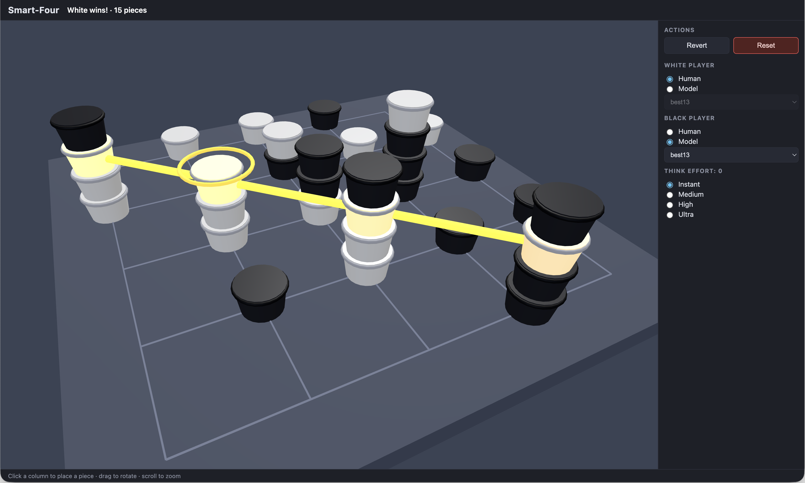

# AlphaZero Model to Play SmartFour Game

Advanced tic-tac-toe on a 5×5×5 board: two players place pieces on a 5×5 grid
and stack up to five high; first to line up four own pieces in 3D space wins
(horizontal planes, vertical stacks, and rising diagonals). Full rules in
[`docs/game.md`](docs/game.md).



## Layout

| Path     | Contents                                                        |
| -------- | --------------------------------------------------------------- |
| `ui/`    | Web UI — TypeScript + Vite + Three.js, includes the game engine |
| `model/` | AlphaZero-style model (Python, PyTorch): rules, resnet, MCTS, training |
| `docs/`  | Game rules, UI requirements, model spec                         |

## Model

AlphaZero-style training and inference for smart-four (resnet policy/value +
MCTS), CPU or GPU (Metal/CUDA). See [`docs/model.md`](docs/model.md) for details.

> [!NOTE]
> GPU is necessary to train the model in reasonable time.
It took ~24 hours to run 100 training iterations on RTX-3060.

You can download model checkpoint from
[releases page](https://github.com/cyb70289/rl-smartfour/releases).
Or follow steps below to train you own model:

```sh
cd model
python3 -m venv .venv
.venv/bin/pip install -r requirements.txt
.venv/bin/python -m smartfour.train --config config.toml --iterations 100
```

## UI

See [`docs/ui.md`](docs/ui.md) for design principals.

The machine player is the trained model checkpoint. Train the model
by yourself or download `best{n}.pt` from the
[releases page](https://github.com/cyb70289/rl-smartfour/releases) and
save it as `model/checkpoints/best{n}.pt` (larger n = stronger model),
then build and serve:

```sh
cd ui
npm install        # first time
npm run build
npm run preview -- --host 0.0.0.0 --port 8032
```

Play the game in a web browser, e.g., http://127.0.0.1:8032/.
White and black players can be human or a model.

## CREDIT

- `DeepSeek-v4-Flash-0731` for design and coding.
- `GLM-5.3` for performance improvement.
- `pi` codig agent, `grill me` skill.
